# URAN-4 Ionospheric Scintillation Analyzer

A scientific software suite for the primary processing, filtering, and time-frequency analysis (spectroscopy) of radio astronomical signals from the **URAN-4 radio telescope**. 

Designed for processing and analyzing dual-frequency (20 MHz and 25 MHz) interferometric observations, this tool helps researchers isolate ionospheric scintillation scales, estimate ionospheric drift velocities, and perform high-resolution spectral analyses.

---

## Theoretical Tools & Algorithms

This suite integrates a range of digital signal processing (DSP) and statistical estimation techniques:

### 1. Signal Pre-processing & Cleaning
* **Hampel Filter (Outlier Detection):** Uses a rolling median and Median Absolute Deviation (MAD) to detect and remove industrial impulse noise/spikes.
* **Savitzky-Golay Filter:** Applies polynomial smoothing to reconstruct signal continuity while preserving the physical amplitude of ionospheric scintillations.
* **PCHIP Interpolation:** Upsamples the signal ($3\times$) using Piecewise Cubic Hermite Interpolating Polynomials to increase detail without introducing the ringing artifacts (overshoot) common in spline interpolation.
* **Red Noise Generation:** Synthesizes Brownian bridge-corrected red noise to seamlessly fill calibration gaps in the data without creating boundary artifacts.
* **Tukey Windowing:** Applies a tapered cosine window to the signal boundaries to suppress edge artifacts ("edge fans") during Fourier and Wavelet transforms.

### 2. Wavelet & Time-Frequency Analysis
* **Continuous Wavelet Transform (CWT):** Uses Generalized Morse Wavelets to analyze the non-stationary frequency content of scintillations over time.
* **Synchrosqueezing Transform (SST):** Reassigns CWT coefficients along the frequency axis to sharpen the spectrogram, producing extremely narrow, high-resolution spectral lines.
* **Butterworth Bandpass Filter:** A 4th-order SOS (Second-Order Sections) filter used to isolate specific temporal scales, categorizing them into *"Small bubbles"* ($5\text{--}150\text{ s}$) and *"Large clouds"* ($150\text{--}600\text{ s}$).

### 3. Spectral Analysis & Drift Velocity Estimation
* **Thomson Multitaper Power Spectral Density (PSD):** Uses Discrete Prolate Spheroidal Sequences (DPSS/Slepian tapers) to estimate a low-variance, low-bias power spectrum.
* **Thomson F-Test:** A statistical test used to detect deterministic harmonic lines against a stochastic red-noise background, determining the fundamental oscillation period ($T_0$) and its harmonics ($2T, 3T$).
* **Multitaper Cross-Spectral Analysis:** Calculates the co-spectrum (in-phase), quadrature spectrum (phase shift), and magnitude-squared coherence between the 20 MHz and 25 MHz interferometric channels.
* **Ionospheric Drift Velocity Estimation (IDVE):** Calculates time delays and horizontal drift velocities based on the cross-spectral phase difference and the known physical separation of the telescope beams ($2500\text{ m}$).

---

## Installation

1. Install [uv](https://github.com/astral-sh/uv), the fast Python package manager (e.g., `pip install uv` or via your system's package manager).
2. Clone this repository and navigate to the project directory.
3. Launch the application (this automatically creates a virtual environment and installs all dependencies):
   ```bash
   uv run app.py
   ```

---

## Usage Guide

### 1. Loading Data
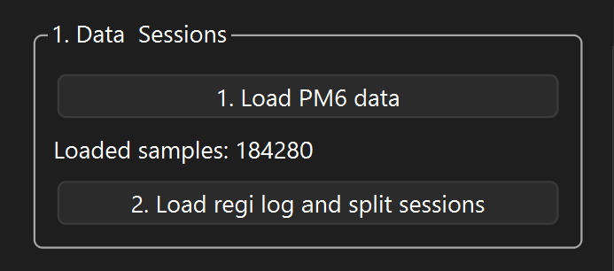
* Click **"1. Load PM6 data"** to load the raw binary observation data.
* Click **"2. Load regi log and split sessions"** to automatically split the data into individual observation sessions and fill calibration gaps using red noise.

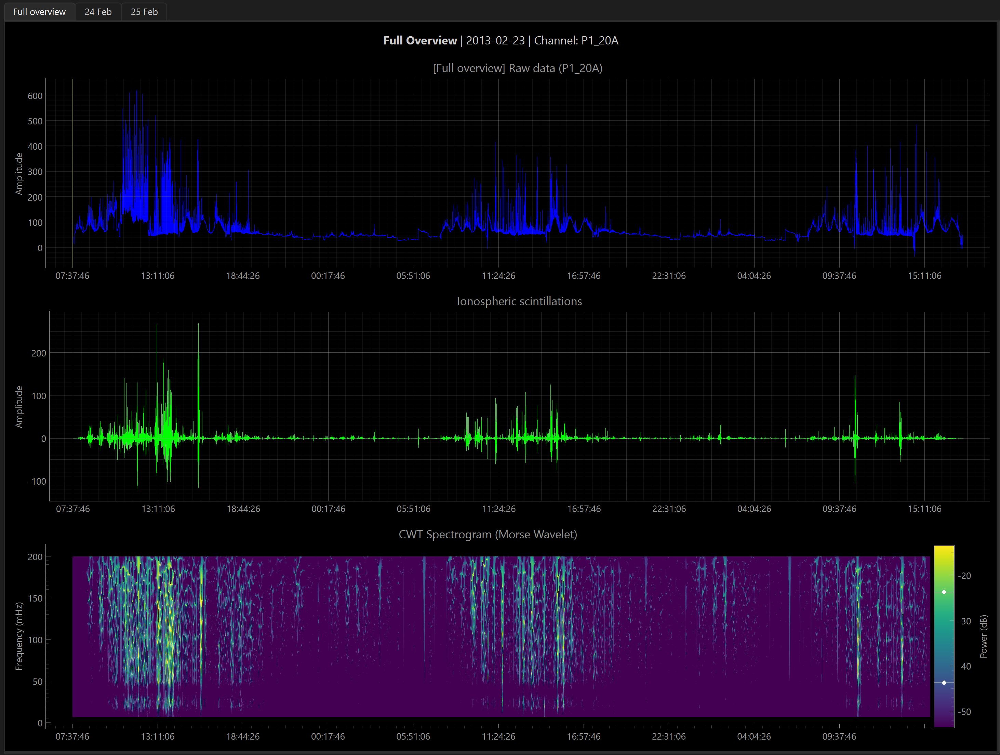

After loading the REGI log, the dataset is automatically split by observation date and target source. The interface generates day tabs (e.g., **Full overview**, plus dates), which contain sub-tabs for each observed astronomical source.

### 2. Channel Selection and View Options
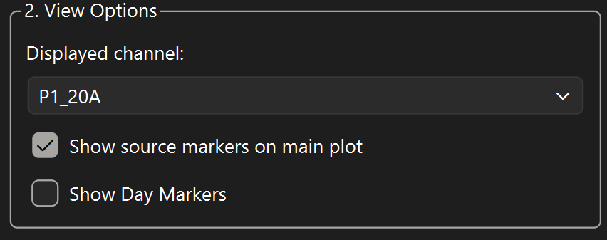
* Select the desired receiver channel or calculated baseline difference from the **Displayed channel:** dropdown (e.g., raw channels like `P1_20A`, `P2_20B`, or calculated baseline differences like `20 MHz Pol A (P-M)`).
* Toggle **Show source markers on main plot** to visualize the beginning and end of each source transit in the main plot.

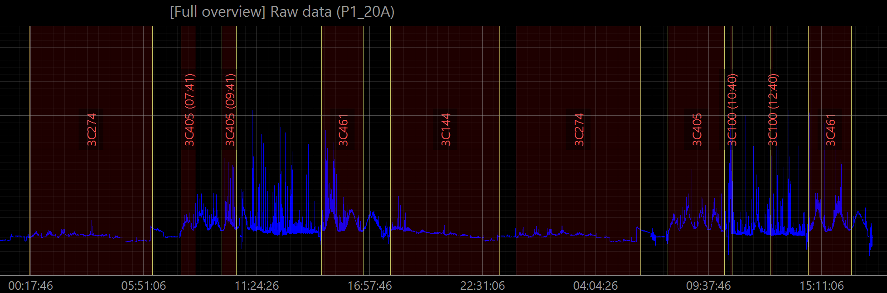

* Toggle **Show Day Markers** to mark the start and end of the observing day.

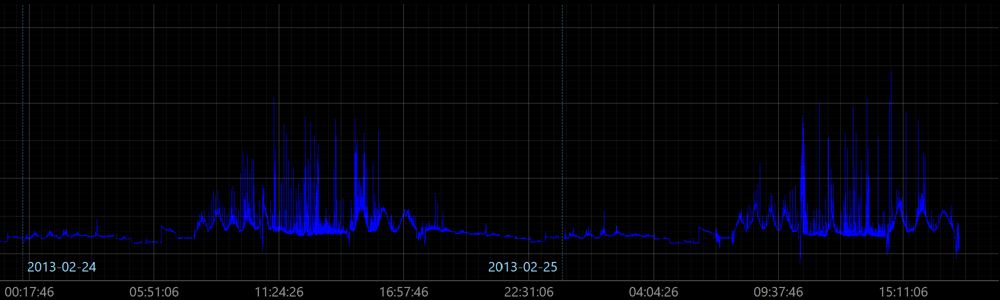

### 3. Signal Processing & Filtering
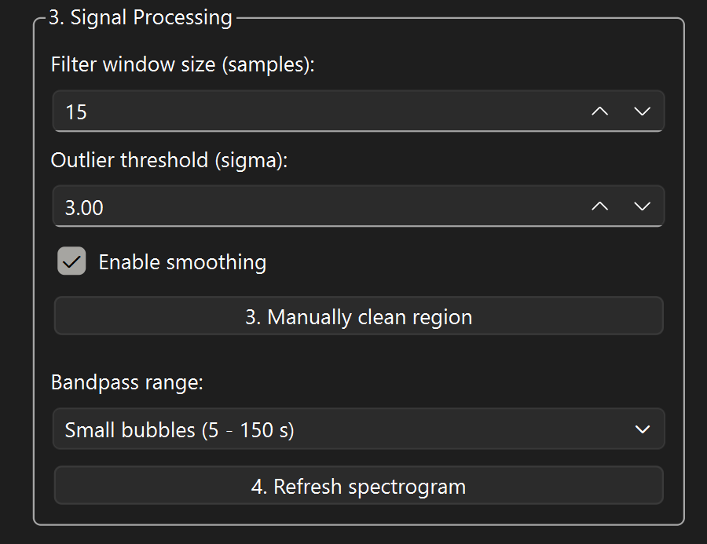
* Adjust the **Filter window size (samples):** and **Outlier threshold (sigma):** spinboxes for the Hampel filter to aggressively or softly clean outliers.
* Toggle **Enable smoothing** to smooth the signal using the Savitzky-Golay algorithm.
* Select the desired **Bandpass range:** (e.g., *Small bubbles (5 - 150 s)* or *Large clouds (150 - 600 s)*). Changing this selection automatically triggers the bandpass filter and recalculates the CWT spectrogram. You can also manually trigger a recalculation by clicking **"4. Refresh spectrogram"**.
* Replace highly noisy regions manually: drag the boundaries of the shaded selection region on the **Raw data** plot to cover the noise, and click **"3. Manually clean region"** to replace the selected segment with synthetic red noise.

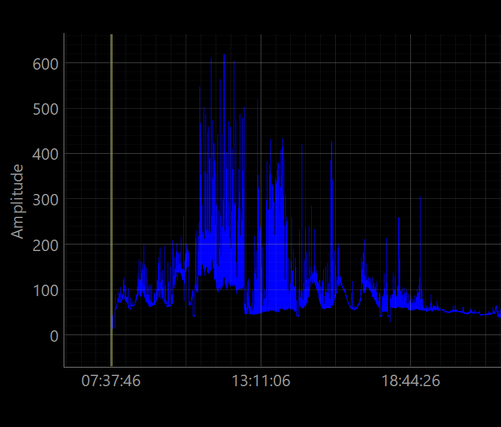 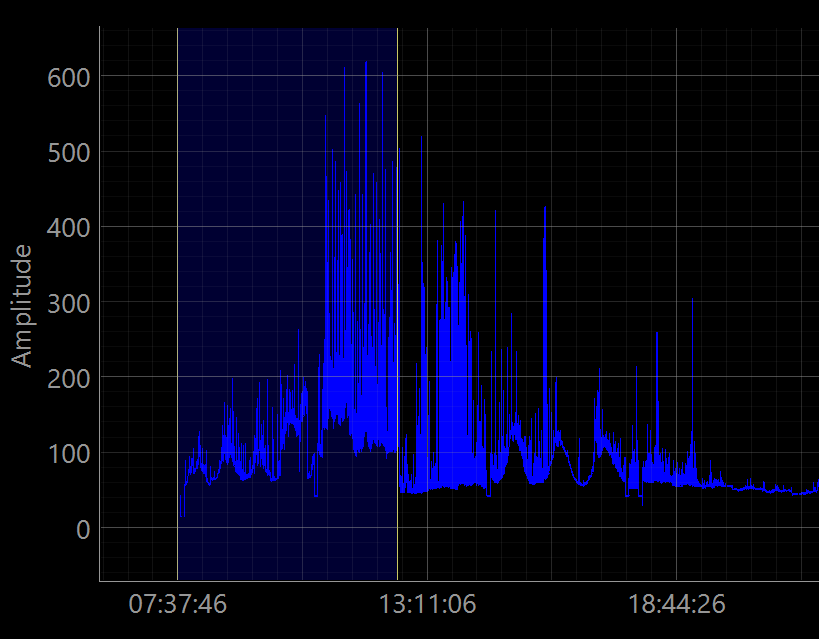

### 4. Spectral Analysis
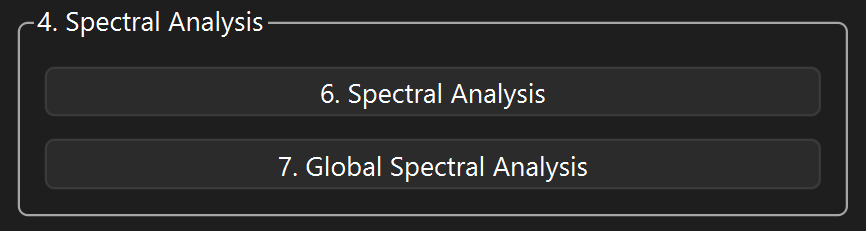
* Click **"6. Spectral Analysis"** to compute the Multitaper PSD, F-Test, and Cross-Spectrum for the currently active source tab.
* Click **"7. Global Spectral Analysis"** to process the entire dataset.
* View the results in the newly opened sub-tabs: **Multitaper PSD**, **Thomson F-Test**, **Cross-Spectrum**, and **Ionospheric Drift Velocity Estimation** (which includes detected periods $T_0$, $2T$, $3T$ and the estimated horizontal drift velocities calculated from the 20 MHz and 25 MHz beams).

### 5. Exporting Results
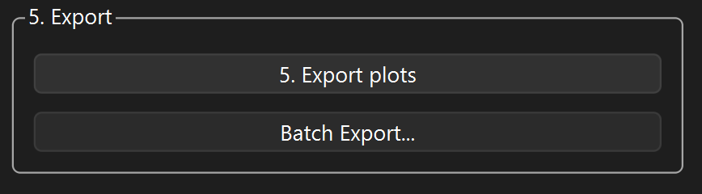
* Use **"5. Export plots"** to save the current view (Raw, Filtered, and/or Spectrogram) to an image file. You can select which sub-plots to include.
* Use **"Batch Export..."** to open the batch processing window, where you can select sessions, channels, spectral bands, and which plots/logs to output. This automatically processes and saves all requested assets (such as *Raw Signal*, *Filtered (Scintillations)*, *CWT Spectrogram*, *Multitaper PSD*, *Thomson F-Test*, *Cross-Spectrum*, and *IDVE (txt log)*) to your chosen output folder, alongside a `BatchExportSettings.txt` file containing the analysis parameters.

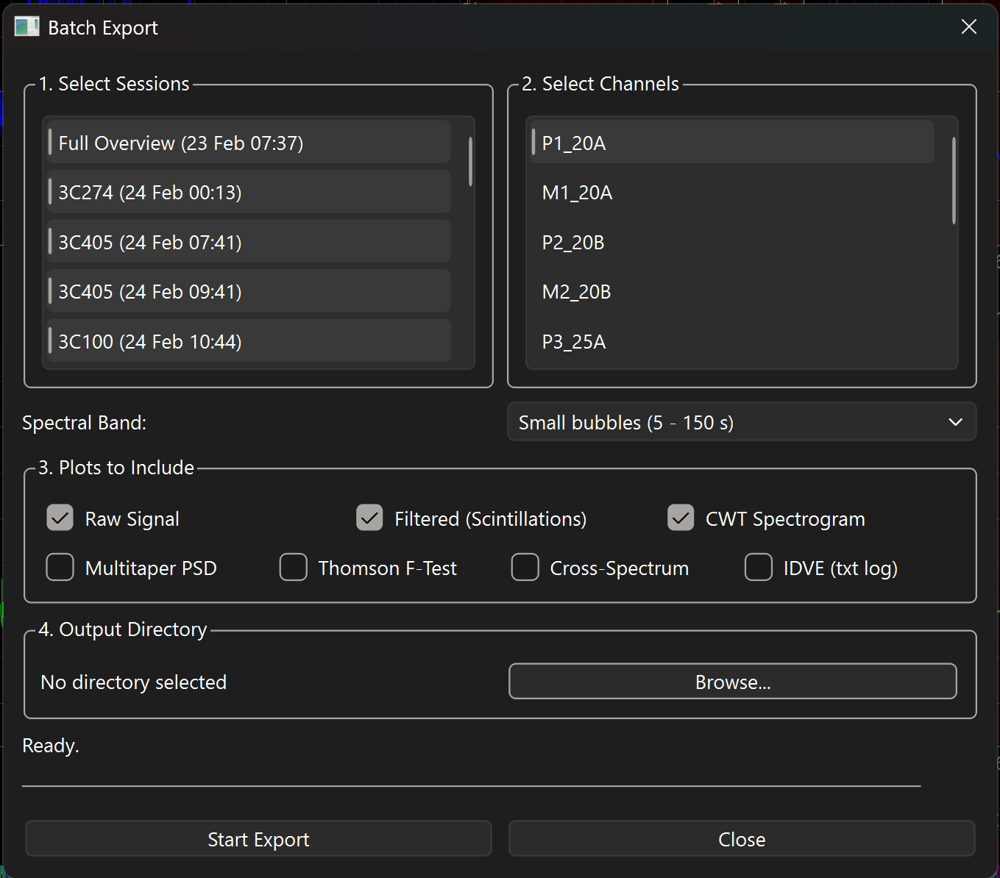

### 6. Adjusting Hyperparameters
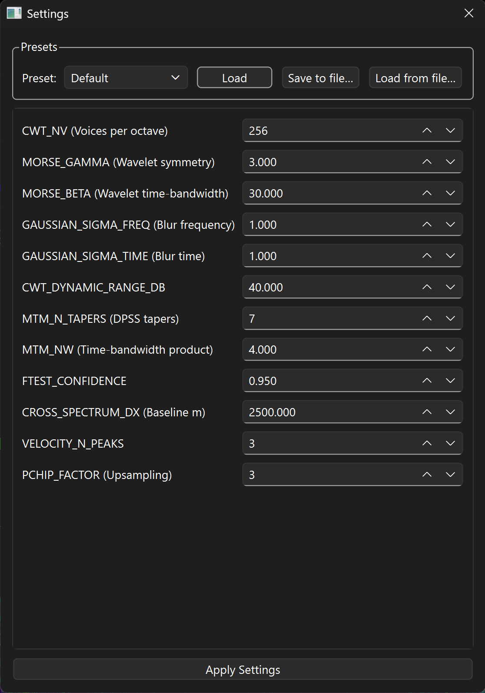
Click the **⚙ Settings** button at the bottom of the left panel to open the settings dialog, where you can fine-tune all CWT and spectral hyperparameters. 

* Use the **Preset** dropdown to load one of three built-in profiles: **Default**, **Fast Preview**, or **High Resolution**, then click **"Load"** to populate the fields.
* Use **"Save to file…"** to export the current parameters to a custom JSON config.
* Use **"Load from file…"** to import a previously saved custom JSON config.
* Click **"Apply Settings"** to save your changes.

---

## Configuration Parameters (`core/config.py`)

These parameters define the default values for the processing pipeline and can be adjusted via the UI settings or by editing `core/config.py` directly:

| Parameter | Default | Description |
| :--- | :--- | :--- |
| `DEFAULT_WINDOW_SIZE` | `15` | Hampel filter window size (number of samples) |
| `DEFAULT_N_SIGMAS` | `3.0` | Standard deviation threshold for outlier spike removal |
| `SAVGOL_POLYORDER` | `2` | Savitzky-Golay polynomial order |
| `TUKEY_ALPHA` | `0.1` | Edge smoothing taper degree for the Tukey window |
| `MTM_N_TAPERS` | `7` | Number of DPSS tapers for the Thomson Multitaper method |
| `MTM_NW` | `4.0` | Time-bandwidth product for DPSS windows |
| `FTEST_CONFIDENCE` | `0.95` | Significance level threshold for Fisher's criterion (F-Test) |
| `CROSS_SPECTRUM_DX` | `2500` | Physical distance between telescope beams (meters) |
| `VELOCITY_N_PEAKS` | `3` | Number of top cross-spectral peaks used for velocity estimation |