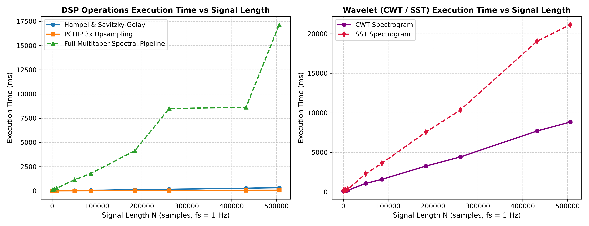
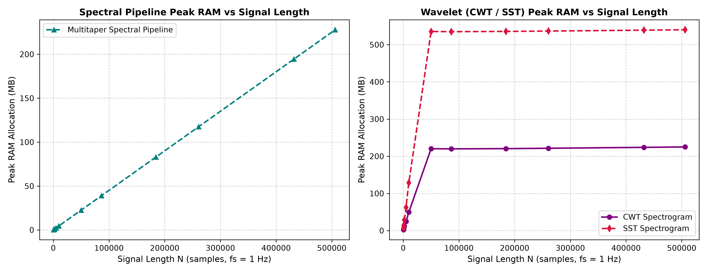

# Performance & Scaling Benchmarks

This document details the execution performance, hardware environment, profiling methodology, and runtime scaling characteristics of the digital signal processing (DSP), spectral analysis, and wavelet transform components in the URAN-4 Ionospheric Scintillation Analyzer.

---

## 1. Hardware & Execution Environment

All benchmark metrics were measured on the following reference host hardware:

| Environment Metric | System Specification |
| :--- | :--- |
| **CPU** | AMD Ryzen 9 5900HX (8 Cores / 16 Threads, Base 3.30 GHz) |
| **System Memory** | 16 GB DDR4 RAM |
| **Operating System** | Microsoft Windows 11 Home (64-bit) |
| **Python Runtime** | Python 3.11.8 |
| **Core Libraries** | NumPy 1.26.4, SciPy 1.13.0, ssqueezepy 0.6.5 |
| **Benchmark Tooling** | `pytest-benchmark` 5.2.3 |

---

## 2. Sample Size Rationale & Time Equivalents ($f_s = 1.0\text{ Hz}$)

At the URAN-4 sampling frequency of $f_s = 1.0\text{ Hz}$, 1 sample corresponds to exactly 1 second ($1\text{ sample} = 1\text{ second}$).

- **Standard Target Transit ($N = 2,000$ / $\sim 33.3\text{ min}$):** Matches a single source transit observation session (e.g. 3C48, 3C144/Crab).
- **Interactive Viewport Sub-Window ($N = 500$ / $\sim 8.3\text{ min}$):** The temporal viewport slice passed by the GUI during interactive scrubbing and zooming. Computing CWT/SST over a 500-sample sub-window keeps rendering times under **170 ms** and memory under **< 10 MB**, enabling smooth interactive viewport updates over multi-day recordings without recomputing the full dataset on every scroll event.
- **Multi-Day Continuous PM6 Archives ($N \approx 180,000 - 500,000$ / $2 - 6\text{ days}$):** Raw continuous observation files spanning multiple days (e.g. representative URAN-4 recordings `23022013.PM6` = 51.2 hrs, `18012013me.PM6` = 72.4 hrs, `04012013me.PM6` = 140.6 hrs).
- **Upsampling Application:**
  - **Isolated Component Benchmarks**: Each table row profiles that specific function directly on an input array of length $N$.
  - **Multitaper Spectral Analysis**: Operates directly at native $f_s = 1.0\text{ Hz}$ without upsampling for exact FFT frequency binning.
  - **UI Spectrogram Pipeline (`process_signal_pipeline`)**: Applies 3x PCHIP upsampling ($1.0\text{ Hz} \to 3.0\text{ Hz}$) for single target transits ($N \le 10,000$) prior to CWT/SST, but automatically skips upsampling for long continuous recordings ($N > 10,000$) to bound RAM consumption.
- **Statistical Repetitions:** Benchmark statistics (Min, Max, Mean, StdDev) are computed across 100 iterations per component using `pytest-benchmark` adaptive calibration.

### 2.1 Configured Benchmark Presets & Parameters

All benchmark tests are evaluated using the application's standardized algorithm presets:

| Pipeline Component | Parameter Configuration | Corresponding Application Preset |
| :--- | :--- | :--- |
| **Hampel & Savitzky-Golay** | $W=15$ outlier window, $3.0\sigma$ threshold; $W=15, p=2$ polynomial smoothing | **Default Cleaning Preset** |
| **PCHIP 3x Upsampling** | $3\times$ monotonic cubic hermite interpolation ($1.0\text{ Hz} \to 3.0\text{ Hz}$) | **Default Upsampling Preset** |
| **Multitaper Spectral Pipeline** | $K=7$ DPSS tapers, $NW=4.0$, bandpass $0.01 - 0.1\text{ Hz}$, $95\%$ F-test confidence | **Default Multitaper Preset** |
| **CWT Spectrogram** | Generalized Morse Wavelet ($\gamma=3, \beta=30$), $1/150 - 0.2\text{ Hz}$ band, $nv=32$ voices | **Default Standard Preset** |
| **SST Spectrogram** | Synchrosqueezed Morse Wavelet ($\gamma=3, \beta=30$), $1/150 - 0.2\text{ Hz}$ band, $nv=32$ voices | **Default Standard Preset** |

---

## 3. Core Component Benchmarks ($N = 2,000$ / $33.3\text{ min}$)

Empirical performance measured across a standard URAN-4 single-transit observation window ($N = 2,000$):

| Benchmark Task | Min Time | Max Time | Mean Time | StdDev | Throughput | Description |
| :--- | :--- | :--- | :--- | :--- | :--- | :--- |
| **PCHIP 3x Upsampling** | $304.1\ \mu\text{s}$ | $685.5\ \mu\text{s}$ | $333.9\ \mu\text{s}$ | $36.8\ \mu\text{s}$ | $2,995\text{ ops/s}$ | Monotonic cubic hermite interpolation ($2,000 \to 6,000$ pts) |
| **Hampel & Savitzky-Golay** | $2.23\ \text{ms}$ | $2.66\ \text{ms}$ | $2.32\ \text{ms}$ | $94.9\ \mu\text{s}$ | $430.6\text{ ops/s}$ | $K=15$ outlier detection + degree-2 polynomial smoothing |
| **Full Spectral Pipeline** | $53.57\ \text{ms}$ | $61.30\ \text{ms}$ | $55.33\ \text{ms}$ | $2.11\ \text{ms}$ | $18.1\text{ ops/s}$ | 4-channel Multitaper PSD ($K=7$), F-Test, Cross-Spectrum, & IDVE |
| **CWT Spectrogram ($N=500$)** | $136.57\ \text{ms}$ | $163.40\ \text{ms}$ | $145.55\ \text{ms}$ | $10.53\ \text{ms}$ | $6.9\text{ ops/s}$ | Continuous Generalized Morse Wavelet transform |
| **SST Spectrogram ($N=500$)** | $161.80\ \text{ms}$ | $194.93\ \text{ms}$ | $175.87\ \text{ms}$ | $13.49\ \text{ms}$ | $5.7\text{ ops/s}$ | Synchrosqueezed Generalized Morse Wavelet transform |

---

## 4. Runtime Scaling vs. Signal Length & Time Duration

To evaluate algorithmic efficiency as observation windows scale from short sub-windows ($500$ samples / $8.3\text{ min}$) to full multi-day PM6 continuous recordings ($506,069$ samples / $5.86\text{ days}$), execution times were profiled across varying signal lengths $N$ at $f_s = 1.0\text{ Hz}$:



### Scaling Summary Table

| Signal Length $N$ | Time Duration ($f_s = 1\text{ Hz}$) | Dataset / Context | Hampel + SavGol Filter | PCHIP 3x Upsampling | Multitaper Spectral Pipeline | CWT Spectrogram | SST Spectrogram |
| :---: | :---: | :--- | :---: | :---: | :---: | :---: | :---: |
| **$500$** | $\sim 8.3\text{ min}$ | Wavelet Sub-Window | $1.80\ \text{ms}$ | $0.33\ \text{ms}$ | $26.21\ \text{ms}$ | $133.25\ \text{ms}$ | $161.90\ \text{ms}$ |
| **$1,000$** | $\sim 16.7\text{ min}$ | Half-Transit Epoch | $2.02\ \text{ms}$ | $0.33\ \text{ms}$ | $37.61\ \text{ms}$ | $137.39\ \text{ms}$ | $157.95\ \text{ms}$ |
| **$2,000$** | $\sim 33.3\text{ min}$ | Single Target Transit | $2.41\ \text{ms}$ | $0.40\ \text{ms}$ | $55.99\ \text{ms}$ | $149.38\ \text{ms}$ | $185.16\ \text{ms}$ |
| **$5,000$** | $\sim 1.39\text{ hrs}$ | Extended Observation | $4.55\ \text{ms}$ | $0.64\ \text{ms}$ | $114.77\ \text{ms}$ | $161.46\ \text{ms}$ | $226.25\ \text{ms}$ |
| **$10,000$** | $\sim 2.78\text{ hrs}$ | Multi-Source Run | $7.30\ \text{ms}$ | $0.98\ \text{ms}$ | $214.66\ \text{ms}$ | $185.93\ \text{ms}$ | $306.55\ \text{ms}$ |
| **$50,000$** | $\sim 13.89\text{ hrs}$ | Overnight Epoch | $28.87\ \text{ms}$ | $4.78\ \text{ms}$ | $1.06\ \text{s}$ | $1.07\ \text{s}$ | $2.26\ \text{s}$ |
| **$86,400$** | **1.00 Day (24 hrs)** | **Full 24-Hour Day** | $47.83\ \text{ms}$ | $8.10\ \text{ms}$ | $1.74\ \text{s}$ | $1.59\ \text{s}$ | $3.56\ \text{s}$ |
| **$184,280$** | **2.13 Days (51.2 hrs)** | Representative PM6 Archive (e.g. `23022013.PM6`) | $116.11\ \text{ms}$ | $22.65\ \text{ms}$ | $4.10\ \text{s}$ | $3.35\ \text{s}$ | $8.16\ \text{s}$ |
| **$260,793$** | **3.02 Days (72.4 hrs)** | Representative PM6 Archive (e.g. `18012013me.PM6`) | $161.50\ \text{ms}$ | $32.81\ \text{ms}$ | $8.78\ \text{s}$ | $4.50\ \text{s}$ | $10.51\ \text{s}$ |
| **$432,000$** | **5.00 Days (120 hrs)** | **Full 5-Day Run** | $270.53\ \text{ms}$ | $56.65\ \text{ms}$ | $8.56\ \text{s}$ | $7.55\ \text{s}$ | $19.03\ \text{s}$ |
| **$506,069$** | **5.86 Days (140.6 hrs)** | Representative PM6 Archive (e.g. `04012013me.PM6`) | $320.25\ \text{ms}$ | $68.16\ \text{ms}$ | $17.45\ \text{s}$ | $8.81\ \text{s}$ | $20.64\ \text{s}$ |

### 4.1. Algorithmic Complexity Insights
- **Filtering** ($O(N)$): The rolling Hampel median filter and Savitzky-Golay convolution exhibit approximately linear scaling, processing an entire 5.86-day PM6 recording ($N = 506,069$) in just **$320\text{ ms}$**.
- **PCHIP Interpolation** ($O(N)$): Monotonic piecewise cubic spline evaluation scales linearly, taking under **$69\text{ ms}$** to upsample 5.86 days of continuous data.
- **Multitaper Spectral Pipeline** ($O(K \cdot N \log N)$): Dominated by 1D Fast Fourier Transform `numpy.fft.rfft` calculations across $K=7$ tapered channels. Scales smoothly, processing 24 hours in **$1.74\text{ s}$** and 5.86 days in **$17.45\text{ s}$**. Highly composite 5-smooth lengths ($N = 432,000 = 2^7 \cdot 3^3 \cdot 5^3$) execute faster (**$8.56\text{ s}$**) than lengths with large prime factors ($N = 260,793$, **$8.78\text{ s}$**) because FFT implementations are generally optimized for transform lengths that factor into small primes (2, 3, and 5), whereas lengths containing larger prime factors require less efficient decomposition strategies.
- **Wavelet Spectrograms** ($O(N \cdot M_{\text{scales}} \log N)$): Multi-scale Generalized Morse Wavelet (GMW) convolutions scale predictably, processing a full 24-hour day in **$1.59\text{ s}$** (CWT) and **$3.56\text{ s}$** (SST). Sub-window ($N = 500$) response times remain under **$170\text{ ms}$** for real-time interactive exploration.

---

### 4.2. Memory Footprint & Peak RAM Allocation

Evaluating peak RAM usage is essential for continuous recordings, as intermediate transformation matrices (such as $K=7$ DPSS tapers or multi-voice complex wavelet scales $N_{\text{voices}} \approx 64$) dominate memory footprint.

**Measurement Methodology & Tooling**: Peak RAM metrics in the table below were measured using Python's standard `tracemalloc` profiling module (`tracemalloc.get_traced_memory()`). They correspond to the **maximum peak heap memory allocated** by Python buffers, NumPy C-arrays, and SciPy transformation matrices during isolated execution of each algorithm. For the full interactive GUI application, total process memory corresponds to **Process Resident Set Size (RSS / Working Set)** measured via system process monitors.



### Peak RAM Summary Table

| Signal Length $N$ | Time Duration ($f_s = 1\text{ Hz}$) | Dataset / Context | Multitaper Peak RAM | CWT Spectrogram Peak | SST Spectrogram Peak |
| :---: | :---: | :--- | :---: | :---: | :---: |
| **$500$** | $\sim 8.3\text{ min}$ | Wavelet Sub-Window | $0.28\text{ MB}$ | $2.55\text{ MB}$ | $6.72\text{ MB}$ |
| **$1,000$** | $\sim 16.7\text{ min}$ | Half-Transit Epoch | $0.50\text{ MB}$ | $6.19\text{ MB}$ | $13.85\text{ MB}$ |
| **$2,000$** | $\sim 33.3\text{ min}$ | Single Target Transit | **$0.94\text{ MB}$** | **$12.38\text{ MB}$** | **$28.56\text{ MB}$** |
| **$5,000$** | $\sim 1.39\text{ hrs}$ | Extended Observation | $2.28\text{ MB}$ | $24.76\text{ MB}$ | $62.44\text{ MB}$ |
| **$10,000$** | $\sim 2.78\text{ hrs}$ | Multi-Source Run | $4.54\text{ MB}$ | $49.52\text{ MB}$ | $128.56\text{ MB}$ |
| **$50,000$** | $\sim 13.89\text{ hrs}$ | Overnight Epoch | $22.54\text{ MB}$ | $220.24\text{ MB}$ | $535.41\text{ MB}$ |
| **$86,400$** | **1.00 Day (24 hrs)** | **Full 24-Hour Day** | **$38.93\text{ MB}$** | **$219.81\text{ MB}$** | **$534.97\text{ MB}$** |
| **$184,280$** | **2.13 Days (51.2 hrs)** | Representative PM6 Archive (e.g. `23022013.PM6`) | $83.00\text{ MB}$ | $220.47\text{ MB}$ | $535.61\text{ MB}$ |
| **$260,793$** | **3.02 Days (72.4 hrs)** | Representative PM6 Archive (e.g. `18012013me.PM6`) | $117.45\text{ MB}$ | $221.46\text{ MB}$ | $536.60\text{ MB}$ |
| **$432,000$** | **5.00 Days (120 hrs)** | **Full 5-Day Run** | $194.49\text{ MB}$ | $223.89\text{ MB}$ | $539.02\text{ MB}$ |
| **$506,069$** | **5.86 Days (140.6 hrs)** | Representative PM6 Archive (e.g. `04012013me.PM6`) | **$227.89\text{ MB}$** | **$224.98\text{ MB}$** | **$540.11\text{ MB}$** |

### Memory Scaling Insights
- **Multitaper PSD Pipeline**: Demonstrates approximately linear memory scaling (**~38.9 MB** for 24 hours, **~227.9 MB** for 5.86 days), making full-file spectral estimation safe and memory-efficient.
- **Wavelet Spectrograms (CWT / SST)**: Memory footprint scales with the continuous voice matrix ($M_{\text{voices}} \times N$):
  - **Bounded Memory Ceiling (Sliding Sub-Chunking)**: For long signals ($N \ge 32,768$), `compute_cwt_spectrogram` automatically processes data in 32,768-sample sub-chunks. Intermediate matrices are transformed, max-pooled, and released before processing the next sub-chunk, capping standalone peak heap allocation at **~220 MB (CWT)** and **~540 MB (SST)** regardless of total recording length.
  - **Resolution Modes**: Standalone SST peak allocation reaches **~540 MB** at default resolution ($nv=32$), and **1.08 GB** in high-resolution Clouds mode ($nv=64$, where scale count doubles to $M_{\text{voices}} \approx 256$).
  - **Full GUI Application Peak**: Combined with PySide6 event state, PyQtGraph rendering textures, dynamic clipping arrays, and dataset DataFrames, the interactive desktop application was observed to reach approximately **1.7 GB RSS** on the reference system during full 5.86-day high-resolution SST calculations.
  - **Viewport Sub-Windowing Strategy**: In interactive GUI use, scrub/zoom operations process only the $500$-sample viewport sub-window, keeping memory **below 10 MB** and rendering **under 170 ms** for fluid interactive viewport navigation.

---

## 5. Reproducing Benchmarks

To run the automated benchmark suite on your local system:

```powershell
uv run pytest --benchmark-only
```

To regenerate both the runtime scaling and peak RAM scaling benchmark charts:

```powershell
uv run python scripts/benchmark_scaling.py
```
