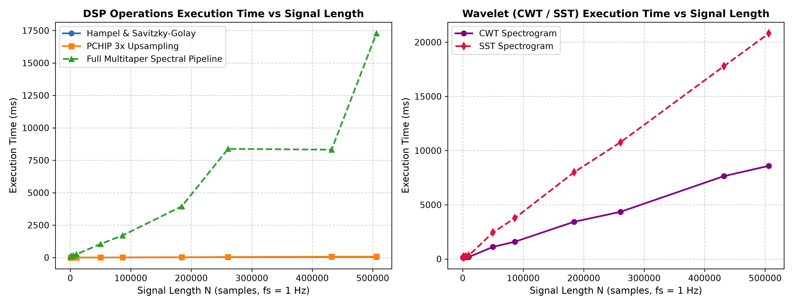
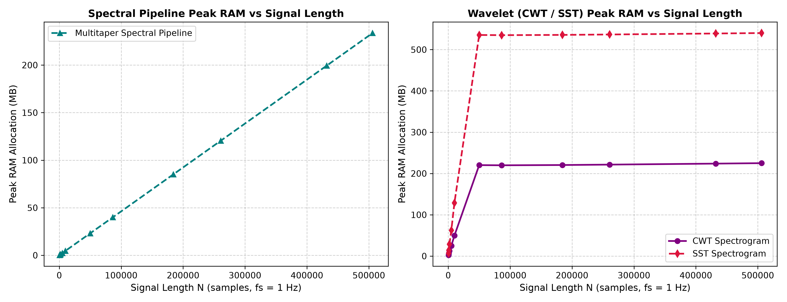

# Performance & Scaling Benchmarks

This document details the execution performance, hardware environment, profiling methodology, and runtime scaling characteristics of the digital signal processing (DSP), spectral analysis, and wavelet transform components in the URAN-4 Ionospheric Scintillation Analyzer.

---

## 1. Hardware & Execution Environment

All benchmark metrics were measured on the following reference host hardware:

| Environment Metric | System Specification |
| :--- | :--- |
| **CPU** | AMD Ryzen 9 5900HX (8 Cores / 16 Threads, Base 3.30 GHz) |
| **System Memory** | 16 GB DDR4 RAM |
| **Operating System** | Microsoft Windows 11 Home (64-bit) |
| **Python Runtime** | Python 3.11.8 |
| **Core Libraries** | NumPy 1.26.4, SciPy 1.13.0, ssqueezepy 0.6.5 |
| **Benchmark Tooling** | `pytest-benchmark` 5.2.3 |

> [!NOTE]
> Benchmark results correspond to the reference profiling environment listed above and are intended to document reproducible baseline performance on this hardware configuration. They are not intended to represent runtime on the newer project minimum dependency specifications declared in `pyproject.toml` (NumPy ≥ 2.4.6, SciPy ≥ 1.17.1).

---

## 2. Sample Size Rationale & Time Equivalents ($f_s = 1.0\text{ Hz}$)

At the URAN-4 receiver sampling frequency of $f_s = 1.0\text{ Hz}$, each discrete sample $N$ represents exactly **1 second** of physical observation time ($1\text{ sample} = 1\text{ second}$). Signal duration is calculated directly as:

$$\Delta t = \frac{N}{f_s} \quad \left[\text{seconds}\right]$$

### 2.1. Benchmark Dataset Categories & Rationale

To evaluate performance across real-world physical usage patterns, benchmarks are grouped into five distinct observational regimes:

| Benchmark Array Length $N$ | Time Duration | Observational & Application Context | Profiling Rationale |
| :---: | :---: | :--- | :--- |
| **$N = 500$** | $\sim 8.3\text{ min}$ | **Short-Window / Rapid Transform Baseline** | Evaluates isolated response time and memory footprint of CWT/SST transformations over short observational segments (mean CWT $\sim 146\text{ ms}$, SST $\sim 161\text{ ms}$; peak RAM $< 10\text{ MB}$). Demonstrates low latency for localized signal analysis without requiring multi-second compute times. |
| **$N = 2,000$** | $\sim 33.3\text{ min}$ | **Single Target Transit (Primary Baseline)** | Standard duration for a discrete radio source passing through the receiver beam (e.g., 3C48, 3C144/Crab). Serves as the primary reference benchmark in **Section 3**. |
| **$N = 30,000$** | $\sim 8.33\text{ hrs}$ | **Extended Multi-Hour Observation Session** | Extended multi-target transit session. Represents the boundary threshold (`PCHIP_LONG_SIGNAL_THRESHOLD = 30,000`) where the processing pipeline automatically transitions upsampling strategies. |
| **$N = 86,400$** | **1.00 Day ($24\text{ hrs}$)** | **Full 24-Hour Continuous Recording** | Standard 24-hour diurnal cycle recording. Used to evaluate multi-hour scaling and daily RAM allocation limits. |
| **$N = 506,069$** | **5.86 Days ($140.6\text{ hrs}$)** | **Full Multi-Day Archive Baseline (`04012013me.PM6`)** | Representative full multi-day continuous PM6 observation file length. Represents the maximum continuous dataset size evaluated during scaling benchmarks. |

---

### 2.2. Impact of Signal Upsampling ($1.0\text{ Hz} \to 3.0\text{ Hz}$)

The application supports optional **$3\times$ PCHIP cubic spline upsampling** ($1.0\text{ Hz} \to 3.0\text{ Hz}$), expanding input length $N \to (N - 1) \cdot 3 + 1$:

1. **Isolated Component Benchmarks (Section 3 & Section 4 Tables)**: Each table row measures that specific algorithm operating directly on an input array of length $N$.
2. **Multitaper Spectral & Velocity Analysis**: Always operates on the **native $f_s = 1.0\text{ Hz}$** series (length $N$) to maintain exact Fast Fourier Transform (FFT) frequency bin spacing without spectral interpolation.
3. **Spectrogram Pipeline (`process_signal_pipeline`)**:
   - **Standard Observational Sessions ($N \le 30,000$)**: $3\times$ PCHIP upsampling ($N \to (N - 1) \cdot 3 + 1$) is applied prior to CWT/SST calculation to improve time-frequency grid resolution.
   - **Multi-Day Continuous Files ($N > 30,000$)**: Upsampling is automatically bypassed ($N \to N$) to bound memory usage and prevent peak RAM from exceeding system limits.
   - **Chunked Processing & Temporal Pooling**: For long recordings ($N \ge 32,768$), `compute_cwt_spectrogram` automatically partitions continuous signals into overlapping 32,768-sample chunks with 16,384-sample overlap, applying temporal max-pooling targeting $\sim 8,000$ display columns to bound peak intermediate allocations and prevent multi-gigabyte display textures.

---

### 2.3. Algorithm Parameters & Benchmark Presets

All benchmark tests are evaluated using the application's standardized algorithm default presets:

| Pipeline Component | Parameter Configuration | Corresponding Application Preset |
| :--- | :--- | :--- |
| **Hampel & Savitzky-Golay** | $W=15$ outlier window, $3.0\sigma$ threshold; $W=15, p=2$ polynomial smoothing | **Default Cleaning Preset** |
| **PCHIP 3x Upsampling** | $3\times$ monotonic cubic hermite interpolation ($1.0\text{ Hz} \to 3.0\text{ Hz}$) | **Default Upsampling Preset** |
| **Multitaper Spectral Pipeline** | $K=7$ DPSS tapers, $NW=4.0$, bandpass $0.01 - 0.1\text{ Hz}$, $99\%$ F-test confidence ($F=6.93$) | **Default Multitaper Preset** |
| **CWT Spectrogram** | Generalized Morse Wavelet ($\gamma=3, \beta=30$), $1/150 - 0.2\text{ Hz}$ band, $nv=32$ voices | **Default Standard Preset** |
| **SST Spectrogram** | Synchrosqueezed Morse Wavelet ($\gamma=3, \beta=30$), $1/150 - 0.2\text{ Hz}$ band, $nv=32$ voices | **Default Standard Preset** |

---

## 3. Core Component Benchmarks

Empirical performance measured across standard baseline configurations. DSP cleaning, PCHIP upsampling, and the multitaper spectral pipeline were benchmarked across a standard single-transit observation window ($N = 2,000$, $\sim 33.3\text{ min}$). Continuous Wavelet Transform (CWT) and Synchrosqueezed Wavelet Transform (SST) were profiled across $N = 500$ ($\sim 8.3\text{ min}$) to evaluate short-window transform latency and keep isolated benchmark execution computationally tractable:

| Benchmark Task | Min Time | Max Time | Mean Time | StdDev | Throughput | Description |
| :--- | :--- | :--- | :--- | :--- | :--- | :--- |
| **PCHIP 3x Upsampling** | $290.9\ \mu\text{s}$ | $1.09\ \text{ms}$ | $332.1\ \mu\text{s}$ | $59.5\ \mu\text{s}$ | $3,011\text{ ops/s}$ | Monotonic cubic hermite interpolation ($2,000 \to 5,998$ pts; $3\times$ sampling rate) |
| **Hampel & Savitzky-Golay** | $2.19\ \text{ms}$ | $3.74\ \text{ms}$ | $2.50\ \text{ms}$ | $276.9\ \mu\text{s}$ | $400.0\text{ ops/s}$ | $K=15$ outlier detection + degree-2 polynomial smoothing |
| **Full Spectral Pipeline** | $56.87\ \text{ms}$ | $60.77\ \text{ms}$ | $58.74\ \text{ms}$ | $1.20\ \text{ms}$ | $17.0\text{ ops/s}$ | 4-channel Multitaper PSD ($K=7$), F-Test, Cross-Spectrum, WLS Phase Regression & IDVE |
| **CWT Spectrogram ($N=500$)** | $142.61\ \text{ms}$ | $159.60\ \text{ms}$ | $149.65\ \text{ms}$ | $7.73\ \text{ms}$ | $6.7\text{ ops/s}$ | Continuous Generalized Morse Wavelet transform |
| **SST Spectrogram ($N=500$)** | $150.07\ \text{ms}$ | $186.94\ \text{ms}$ | $161.48\ \text{ms}$ | $14.73\ \text{ms}$ | $6.2\text{ ops/s}$ | Synchrosqueezed Generalized Morse Wavelet transform |

> [!NOTE]
> Benchmark statistics are generated by `pytest-benchmark` using its automated adaptive calibration and timing machinery.

---

## 4. Runtime Scaling vs. Signal Length & Time Duration

To evaluate algorithmic efficiency as observation windows scale from short segments ($500$ samples / $8.3\text{ min}$) to full multi-day recording lengths ($506,069$ samples / $5.86\text{ days}$), execution times were profiled across varying signal lengths $N$ at $f_s = 1.0\text{ Hz}$.

Each scaling point was measured on synthetic scintillation signals generated via `generate_synthetic_scintillation(length=N, fs=1.0, f_fresnel=0.1, spectral_index=8/3, seed=42)` matching characteristic physical durations and representative PM6 archive file sizes. The scaling benchmark suite (`scripts/benchmark_scaling.py`) executes 3 repetitions for signals below 86,400 samples and 1 repetition for signals of 86,400 samples or longer:



### Scaling Summary Table

| Signal Length $N$ | Time Duration ($f_s = 1\text{ Hz}$) | Dataset / Context | Hampel + SavGol Filter | PCHIP 3x Upsampling | Multitaper Spectral Pipeline | CWT Spectrogram | SST Spectrogram |
| :---: | :---: | :--- | :---: | :---: | :---: | :---: | :---: |
| **$500$** | $\sim 8.3\text{ min}$ | Wavelet Sub-Window | $1.66\ \text{ms}$ | $0.28\ \text{ms}$ | $95.01\ \text{ms}$ | $144.39\ \text{ms}$ | $172.85\ \text{ms}$ |
| **$1,000$** | $\sim 16.7\text{ min}$ | Half-Transit Epoch | $1.97\ \text{ms}$ | $0.33\ \text{ms}$ | $96.70\ \text{ms}$ | $154.95\ \text{ms}$ | $184.46\ \text{ms}$ |
| **$2,000$** | $\sim 33.3\text{ min}$ | Single Target Transit | $2.48\ \text{ms}$ | $0.37\ \text{ms}$ | $122.51\ \text{ms}$ | $164.53\ \text{ms}$ | $204.71\ \text{ms}$ |
| **$5,000$** | $\sim 1.39\text{ hrs}$ | Extended Observation | $4.14\ \text{ms}$ | $0.60\ \text{ms}$ | $191.10\ \text{ms}$ | $168.13\ \text{ms}$ | $271.70\ \text{ms}$ |
| **$10,000$** | $\sim 2.78\text{ hrs}$ | Multi-Source Run | $6.62\ \text{ms}$ | $0.86\ \text{ms}$ | $282.39\ \text{ms}$ | $193.84\ \text{ms}$ | $338.75\ \text{ms}$ |
| **$50,000$** | $\sim 13.89\text{ hrs}$ | Overnight Epoch | $27.33\ \text{ms}$ | $4.65\ \text{ms}$ | $1.14\ \text{s}$ | $1.14\ \text{s}$ | $2.42\ \text{s}$ |
| **$86,400$** | **1.00 Day (24 hrs)** | **Full 24-Hour Day** | $48.28\ \text{ms}$ | $9.64\ \text{ms}$ | $1.93\ \text{s}$ | $1.82\ \text{s}$ | $3.90\ \text{s}$ |
| **$184,280$** | **2.13 Days (51.2 hrs)** | Archive Length (e.g. `23022013.PM6`) | $114.40\ \text{ms}$ | $23.88\ \text{ms}$ | $4.28\ \text{s}$ | $3.50\ \text{s}$ | $8.14\ \text{s}$ |
| **$260,793$** | **3.02 Days (72.4 hrs)** | Archive Length (e.g. `18012013me.PM6`) | $152.00\ \text{ms}$ | $32.91\ \text{ms}$ | $9.04\ \text{s}$ | $4.69\ \text{s}$ | $16.15\ \text{s}$ |
| **$432,000$** | **5.00 Days (120 hrs)** | **Full 5-Day Run** | $382.46\ \text{ms}$ | $133.39\ \text{ms}$ | $11.25\ \text{s}$ | $10.59\ \text{s}$ | $24.11\ \text{s}$ |
| **$506,069$** | **5.86 Days (140.6 hrs)** | Archive Length (e.g. `04012013me.PM6`) | $409.96\ \text{ms}$ | $136.18\ \text{ms}$ | $21.50\ \text{s}$ | $10.28\ \text{s}$ | $24.37\ \text{s}$ |

---

### 4.1. Algorithmic Complexity Insights
- **Filtering** $\mathcal{O}(N)$: The rolling Hampel median filter and Savitzky-Golay convolution exhibit approximately linear scaling, processing an entire 5.86-day equivalent signal ($N = 506,069$) in just **410 ms**.
- **PCHIP Interpolation** $\mathcal{O}(N)$: Monotonic piecewise cubic spline evaluation scales linearly, taking under **137 ms** to upsample 5.86 days of continuous data.
- **Multitaper Spectral Pipeline** $\mathcal{O}(K \cdot N \log N)$: Dominated by 1D Fast Fourier Transform `numpy.fft.rfft` calculations across $K=7$ tapered channels. Incorporates 4-channel Multitaper PSD, F-test, Cross-Spectrum, Weighted Linear Phase Regression, Coherence Gating ($C_{xy} \ge 0.7$), and analytical WLS 95% CIs. Scales smoothly, processing 24 hours in **1.93 s** and 5.86 days in **21.50 s**. Highly composite 5-smooth lengths ($N = 432,000 = 2^7 \cdot 3^3 \cdot 5^3$) execute faster (**11.25 s**) than lengths with large prime factors ($N = 260,793$, **9.04 s** / $N = 506,069$, **21.50 s**). This difference is consistent with FFT implementations generally favoring transform lengths composed of small prime factors; however, the present benchmark does not isolate FFT factorization from other runtime effects.
- **Wavelet Spectrograms**: Multi-scale Generalized Morse Wavelet (GMW) convolutions scale predictably, processing a full 24-hour day in **1.82 s** (CWT) and **3.90 s** (SST). For long signals ($N \ge 32,768$), the implementation applies fixed-chunk sliding transforms ($C = 32,768$, overlap $16,384$) followed by temporal max-pooling, achieving linear $\mathcal{O}(N)$ scaling for multi-day files while keeping intermediate transform allocations bounded. Isolated short-window ($N = 500$) response times remain $\sim 144\text{ ms}$ (CWT) and $\sim 173\text{ ms}$ (SST), suitable for interactive UI exploration.

---

### 4.2. Memory Footprint & Peak RAM Allocation

Evaluating peak RAM usage is essential for continuous recordings, as intermediate transformation matrices (such as $K=7$ DPSS tapers or multi-voice complex wavelet scales $N_{\text{voices}} \approx 64$) dominate memory footprint.

**Measurement Methodology & Tooling**: Peak RAM metrics in the table below were measured using Python's standard `tracemalloc` profiling module (`tracemalloc.get_traced_memory()`). They correspond to the **maximum peak heap memory allocated** by Python buffers, NumPy C-arrays, and SciPy transformation matrices during isolated execution of each algorithm. For the full interactive GUI application, total process memory corresponds to **Process Resident Set Size (RSS / Working Set)** measured via system process monitors.



### Peak RAM Summary Table

| Signal Length $N$ | Time Duration ($f_s = 1\text{ Hz}$) | Dataset / Context | Multitaper Peak RAM | CWT Spectrogram Peak | SST Spectrogram Peak |
| :---: | :---: | :--- | :---: | :---: | :---: |
| **$500$** | $\sim 8.3\text{ min}$ | Wavelet Sub-Window | $0.29\text{ MB}$ | $2.55\text{ MB}$ | $6.72\text{ MB}$ |
| **$1,000$** | $\sim 16.7\text{ min}$ | Half-Transit Epoch | $0.52\text{ MB}$ | $6.20\text{ MB}$ | $13.85\text{ MB}$ |
| **$2,000$** | $\sim 33.3\text{ min}$ | Single Target Transit | **$0.97\text{ MB}$** | **$12.39\text{ MB}$** | **$28.56\text{ MB}$** |
| **$5,000$** | $\sim 1.39\text{ hrs}$ | Extended Observation | $2.36\text{ MB}$ | $24.77\text{ MB}$ | $62.45\text{ MB}$ |
| **$10,000$** | $\sim 2.78\text{ hrs}$ | Multi-Source Run | $4.67\text{ MB}$ | $49.52\text{ MB}$ | $128.56\text{ MB}$ |
| **$50,000$** | $\sim 13.89\text{ hrs}$ | Overnight Epoch | $23.13\text{ MB}$ | $220.24\text{ MB}$ | $535.42\text{ MB}$ |
| **$86,400$** | **1.00 Day (24 hrs)** | **Full 24-Hour Day** | **$39.91\text{ MB}$** | **$219.81\text{ MB}$** | **$534.97\text{ MB}$** |
| **$184,280$** | **2.13 Days (51.2 hrs)** | Archive Length (e.g. `23022013.PM6`) | $85.10\text{ MB}$ | $220.47\text{ MB}$ | $535.61\text{ MB}$ |
| **$260,793$** | **3.02 Days (72.4 hrs)** | Archive Length (e.g. `18012013me.PM6`) | $120.43\text{ MB}$ | $221.46\text{ MB}$ | $536.60\text{ MB}$ |
| **$432,000$** | **5.00 Days (120 hrs)** | **Full 5-Day Run** | $199.43\text{ MB}$ | $223.89\text{ MB}$ | $539.02\text{ MB}$ |
| **$506,069$** | **5.86 Days (140.6 hrs)** | Archive Length (e.g. `04012013me.PM6`) | **$233.68\text{ MB}$** | **$224.98\text{ MB}$** | **$540.11\text{ MB}$** |

### Memory Scaling Insights
- **Multitaper PSD Pipeline**: Demonstrates approximately linear memory scaling (**~38.9 MB** for 24 hours, **~227.9 MB** for 5.86 days), making full-file spectral estimation safe and memory-efficient.
- **Wavelet Spectrograms (CWT / SST)**: Memory footprint scales with the continuous voice matrix ($M_{\text{voices}} \times N$):
  - **Bounded Intermediate Memory Ceiling (Sliding Sub-Chunking)**: For long signals ($N \ge 32,768$), `compute_cwt_spectrogram` automatically processes data in 32,768-sample sub-chunks with 16,384-sample overlap. Intermediate transform matrices are evaluated, max-pooled to approximately 8,000 display columns, and released before processing the next sub-chunk. For the tested long-signal range, this architecture keeps peak intermediate allocation approximately bounded at **~220 MB (CWT)** and **~540 MB (SST)** while bounding the returned spectrogram dimensions.
  - **Resolution Modes**: Standalone SST peak allocation reaches **~540 MB** at default resolution ($nv=32$).
  - **Observed System Memory (GUI Process RSS)**: Combined with PySide6 event state, PyQtGraph rendering textures, dynamic clipping arrays, and dataset DataFrames, the interactive desktop application process was observed to reach approximately **1.7 GB Resident Set Size (RSS)** on the reference host system during full 5.86-day high-resolution SST calculations.
  - **Interactive Responsiveness & Display Pooling Strategy**: In interactive GUI usage, multi-day files are rendered smoothly by returning max-pooled time-frequency arrays ($\sim 8,000$ temporal display columns), avoiding multi-gigabyte texture allocations in the UI. Isolated short-window transforms ($N = 500$) execute in $\sim 146\text{ ms}$ (CWT) and $\sim 161\text{–}176\text{ ms}$ (SST) with $< 10\text{ MB}$ RAM, providing interactive responsiveness for localized inspection.

---

## 5. Reproducing Benchmarks

To run the automated benchmark suite on your local system:

```powershell
uv run pytest --benchmark-only
```

To regenerate both the runtime scaling and peak RAM scaling benchmark charts:

```powershell
uv run python scripts/benchmark_scaling.py
```
